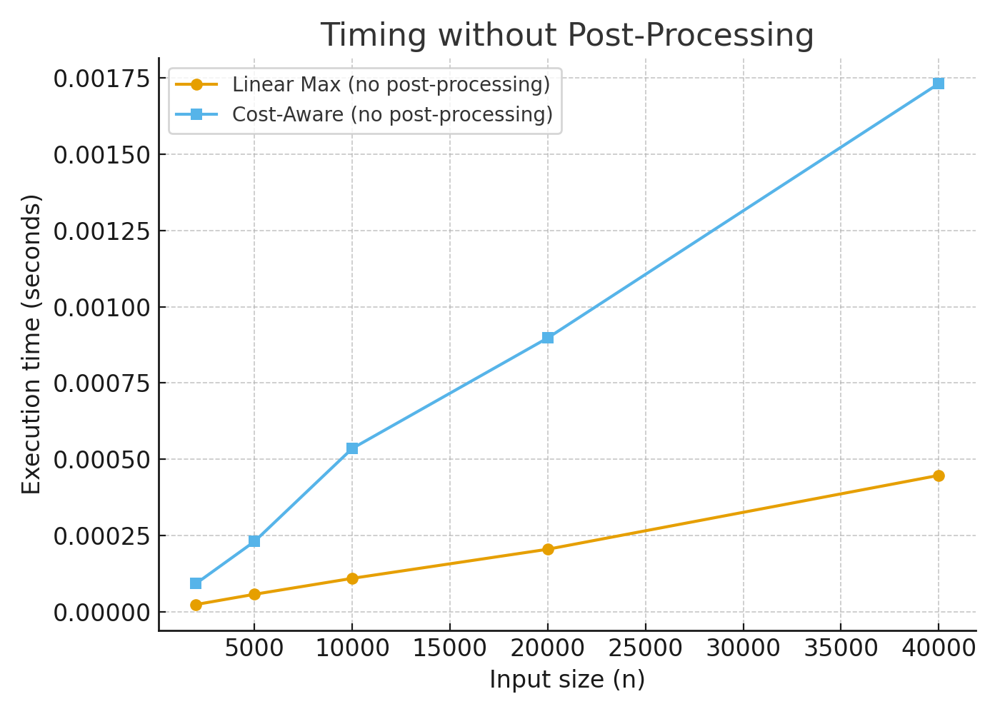
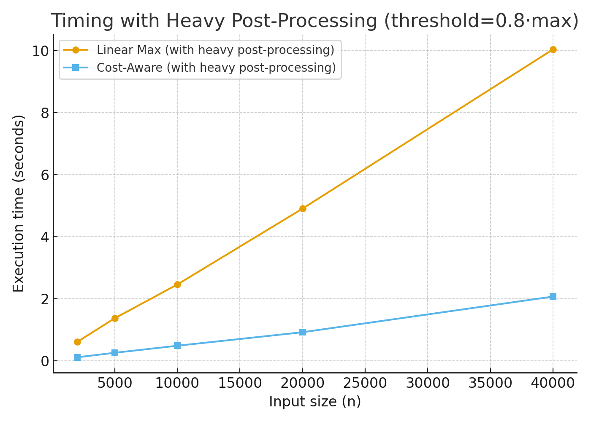

# Beyond Linear Max
### Cost-Aware Maximum Finding


This repository explores a threshold-based approach to maximum finding.  
While the theoretical lower bound for maximum search remains **Θ(n)**,  
we investigate whether **cost-aware filtering** can reduce *practical runtime*  
in scenarios where post-processing of candidate elements is expensive.

---

## 🔍 Idea
- Standard maximum finding requires scanning all elements → Θ(n).
- Our approach introduces a **threshold filter**:
  1. Estimate an upper bound for the maximum.
  2. Discard elements below a threshold (e.g., 50% of the bound or a learned quantile).
  3. Only apply expensive post-processing to the reduced candidate set.
- This does **not** improve worst-case complexity, but can reduce the number of expensive operations in practical settings.

---

## 📊 Applications
- Information retrieval (reduce re-ranking candidates)
- Machine learning (filtering before heavy model inference)
- Database queries (avoiding expensive lookups on low-value rows)
- Financial/streaming systems (focus on top signals only)

---

## ⚙️ Example Code
Run the provided Python file:

```bash
python cost_aware_maximum_finding.py
```

➡️ Full code is available here: [cost_aware_maximum_finding.py](./cost_aware_maximum_finding.py)

**Example output:**
```text
Linear scan: 0.012 sec
Threshold scan: 0.007 sec
```

*(Times depend on data distribution and threshold choice.)*

---

## 📈 Performance Comparison

We provide two complementary plots:

1. **Without post-processing** — shows raw scan overheads. Cost-Aware adds a filter pass, so it’s expected to be slower or similar.
   
   

2. **With heavy post-processing** — simulates expensive work (e.g., DB lookups / model inference) on candidates only. Here the Cost-Aware method benefits by calling the expensive step on far fewer items.
   
   

To reproduce:

```bash
pip install -r requirements.txt
python benchmark.py
```


---

## 🛠️ Tech
- Python 3
- Matplotlib (for plotting)

---

## 📌 Notes
- This is a **prototype** and not an optimized production algorithm.
- The goal is to demonstrate that **cost-aware strategies** can sometimes outperform naive linear scans in practice when post-processing dominates.

---

## 📫 Contact
Maintained by **SuDev**
feel free to open an issue or suggestion!
